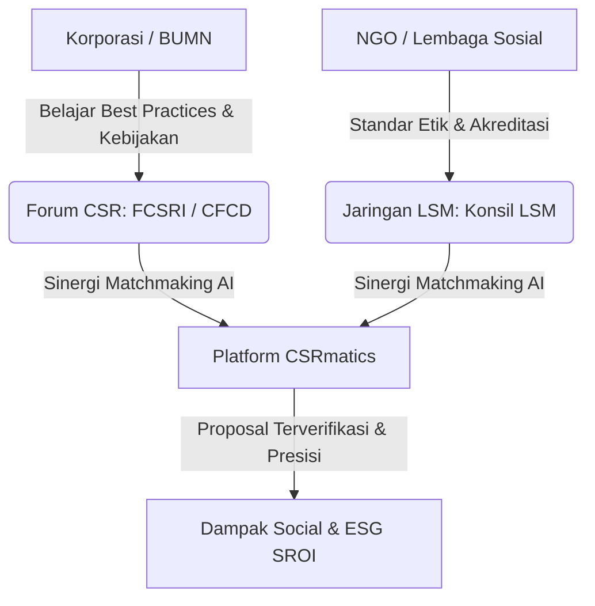

Dalam lanskap Tanggung Jawab Sosial dan Lingkungan (TJSL) di Indonesia, membangun kemitraan tidak dapat dilakukan secara terisolasi. Keberadaan **forum asosiasi CSR korporasi** dan **jaringan dewan payung NGO** memegang peranan krusial sebagai katalisator, validator akuntabilitas, serta wadah sinergi antara sektor privat, pemerintah, dan masyarakat sipil.

Artikel ini membedah peta forum CSR dan jaringan NGO terkemuka di Indonesia, dilengkapi dengan **komentar analisis strategis** bagi korporasi BUMN/Swasta maupun lembaga sosial.

---

## 1. Peta Forum & Asosiasi CSR Korporasi di Indonesia

Bagi korporasi, bergabung atau berjejaring dengan asosiasi CSR resmi memberikan akses pada *best practices*, standar pelaporan terbaru, serta advokasi kebijakan dengan pemerintah pusat maupun daerah.

| Nama Organisasi / Forum | Cakupan Wilayah | Karakteristik Utama & Program unggulan |
| :--- | :--- | :--- |
| **Forum CSR Indonesia (FCSRI)** | Nasional | Organisasi profesi resmi mitra strategis Pemerintah Pusat/Daerah. Memiliki program edukasi **CSR Academy** dan aktif melakukan advokasi regulasi TJSL. |
| **CFCD** *(Corporate Forum for Community Development)* | Nasional | Asosiasi senior bagi praktisi *Community Development Officer* (CDO) & *CSRO*. Memiliki majalah rutin *CSR Review* dan forum pertemuan antar-anggota bergilir. |
| **Forum CSR Daerah (misal: DKI Jakarta, Jabar, Jatim)** | Regional / Provinsi | Berfokus pada pemetaan isu lokal, keselarasan program CSR dengan Rencana Pembangunan Jangka Menengah Daerah (RPJMD) Pemda setempat. |

> ### 💡 Komentar & Analisis Taktis CSRmatics:
> * **FCSRI vs CFCD**: Jika perusahaan Anda membutuhkan legitimasi kebijakan tingkat nasional dan pelatihan kapabilitas tim, **FCSRI** adalah pintu masuk utama. Namun, jika Anda membutuhkan *benchmark* teknis pelaksanaan lapangan dan *networking* praktisi CDO tingkat tapak, **CFCD** memegang pengalaman praktis yang sangat matang.
> * **Forum CSR Daerah**: Sangat vital bagi korporasi yang memiliki pabrik atau wilayah operasional Ring 1 di daerah. Berjejaring dengan Forum CSR Pemda mencegah risiko tumpang tinding (*overlapping*) bantuan dengan APBD.

---

## 2. Peta Forum & Jaringan NGO Terverifikasi

Salah satu kekhawatiran terbesar korporasi saat menyalurkan dana hibah CSR adalah risiko akuntabilitas (*fake NGO* atau LSM kemitraan tidak transparan). Memahami jaringan dewan payung NGO menjadi kunci *due diligence*.

| Nama Jaringan / Konsorsium | Cakupan Wilayah | Karakteristik & Fungsi Legitimasi |
| :--- | :--- | :--- |
| **Konsil LSM Indonesia** | Nasional | Dewan payung utama yang menetapkan Kode Etik dan standar transparansi keuangan LSM di Indonesia. |
| **FOKER LSM Papua & Forum LSM Provinsi** | Regional / Spesifik Daerah | Konsorsium LSM lokal di wilayah khusus (seperti Papua, Aceh, Sulawesi) yang memahami dinamika adat dan budaya setempat. |
| **Jaringan Mitra Funder Besar** *(misal: Yayasan Tifa, Ford Foundation)* | Nasional & International | Daftar lembaga penerima hibah (*grantees*) dari funder reputasi tinggi yang menjadi *proxy* direktori NGO terverifikasi per isu. |

> ### 💡 Komentar & Analisis Taktis CSRmatics:
> * **Konsil LSM sebagai Stempel Legitimasi**: Korporasi disarankan mengutamakan mitra NGO yang terdaftar atau menerapkan Kode Etik **Konsil LSM Indonesia**. Ini memberikan jaminan bahwa audit keuangan dan transparansi laporan dapat dipertanggungjawabkan di mata publik.
> * **Konstruksi Jaringan Regional**: Untuk program di daerah terpencil (3T), menggaet NGO anggota **FOKER LSM Papua** atau forum lokal jauh lebih efektif dibandingkan membawa NGO dari Jakarta, karena mereka memiliki *social license to operate* yang kuat di tingkat adat.

---

## 3. Strategi Manfaat Saling Menguntungkan (*Win-Win Synergy*)

Bagaimana korporasi dan NGO memanfaatkan ekosistem forum ini secara konkrit?

### A. Untuk Korporasi (Buyers / Donors):
1. **Cek Rekam Jejak**: Gunakan direktori Konsil LSM dan mitra *funder* besar sebagai acuan awal penyaringan mitra NGO.
2. **Adopsi Standar SROI**: Manfaatkan pelatihan dari CFCD / FCSRI untuk menghitung dampak *Social Return on Investment*.

### B. Untuk NGO (Implementers):
1. **Ikuti CSR Academy**: Tingkatkan kapasitas tim dengan mengikuti pelatihan penulisan proposal berstandar GRI & ESG.
2. **Masuk ke Direktori Terverifikasi**: Daftarkan profil lembaga Anda ke direktori transparan seperti CSRmatics agar mudah ditemukan oleh korporasi anggota forum CSR.

---

## 4. Kesimpulan: Peran Platform AI dalam Mengakselerasi Sinergi

Meskipun forum dan asosiasi fisik seperti FCSRI, CFCD, dan Konsil LSM sangat penting sebagai wadah ukhuwah dan regulasi, proses pencocokan (*matchmaking*) proposal CSR secara manual sering kali memakan waktu berbulan-bulan.

Melalui **[CSRmatics Two-Sided Platform](/database-perusahaan)**, ekosistem forum CSR dan jaringan NGO diintegrasikan dengan teknologi AI untuk:
*   Melakukan verifikasi data legalitas NGO secara otomatis.
*   Mencocokkan pilar ESG korporasi dengan proposal NGO secara presisi (*Real-time Matching*).
*   Menyediakan dashboard pelaporan dampak sosial yang transparan sesuai standar akuntabilitas publik.
